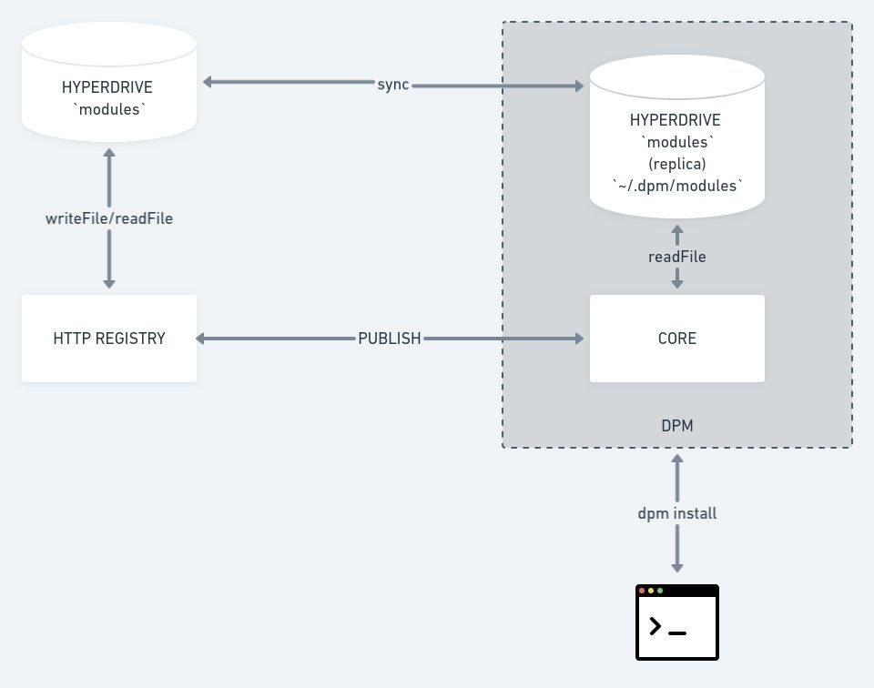

gpm
===

A package manager built on top of Dat. For fun. THIS IS JUST A DEMO/TOY PROJECT. 🧸

[](https://oclif.io)
[](https://npmjs.org/package/gpm)
[](https://npmjs.org/package/gpm)
[](https://github.com/geut/gpm/blob/master/package.json)



<!-- toc -->
* [Usage](#usage)
* [Commands](#commands)
<!-- tocstop -->
# Usage
<!-- usage -->
There are 2 things that you should do before start using gpm as your funny package manager.

First is to run your own registry, so, on one machine you should run

```sh-session
$ gpm registry
```
That will create a registry and start the registry endpoint on the current directory. **You run this only once**

The other task that _everyone_ should run is the daemon. Looks like this:

```sh-session
$ gpm daemon
```
This will sync with the registry and keep seeding your local copy of it.

_NOTE: before run the daemon be sure to set it up with the public key provided by the registry command. Take a look to the `conf` command_

Boom :boom: ! You are ready to run your publish (`newdep`) or installs. :cool:

<!-- usagestop -->
# Commands
<!-- commands -->
* [`gpm conf [KEY] [VALUE]`](#gpm-conf-key-value)
* [`gpm daemon [PORT] [REGISTRYID]`](#gpm-daemon-port-registryid)
* [`gpm help [COMMAND]`](#gpm-help-command)
* [`gpm install [PACKAGE]`](#gpm-install-package)
* [`gpm newdep [PACKAGE] [REGISTRYID]`](#gpm-newdep-package-registryid)
* [`gpm registry [DIRECTORY]`](#gpm-registry-directory)

## `gpm conf [KEY] [VALUE]`

Configuration for gpm.

```
USAGE
  $ gpm conf [KEY] [VALUE]

ARGUMENTS
  KEY    Key configuration.
  VALUE  Value configuration.
```

_See code: [src/commands/conf.js](https://github.com/geut/gpm/blob/v0.0.0/src/commands/conf.js)_

## `gpm daemon [PORT] [REGISTRYID]`

Fetch a package from the dat based registry

```
USAGE
  $ gpm daemon [PORT] [REGISTRYID]

ARGUMENTS
  PORT        [default: 9998] Starts the dat-rpc daemon on the selected port.
  REGISTRYID  [default: geut] Registry to use in gpm.
```

_See code: [src/commands/daemon.js](https://github.com/geut/gpm/blob/v0.0.0/src/commands/daemon.js)_

## `gpm help [COMMAND]`

display help for gpm

```
USAGE
  $ gpm help [COMMAND]

ARGUMENTS
  COMMAND  command to show help for

OPTIONS
  --all  see all commands in CLI
```

_See code: [@oclif/plugin-help](https://github.com/oclif/plugin-help/blob/v2.2.0/src/commands/help.ts)_

## `gpm install [PACKAGE]`

Fetch a package from the dat based registry

```
USAGE
  $ gpm install [PACKAGE]

ARGUMENTS
  PACKAGE  Download selected <package> from the dat based registry

OPTIONS
  -v, --version=version  Specific version to retrieve from the dat based registry
```

_See code: [src/commands/install.js](https://github.com/geut/gpm/blob/v0.0.0/src/commands/install.js)_

## `gpm newdep [PACKAGE] [REGISTRYID]`

Add a new dependency to the registry

```
USAGE
  $ gpm newdep [PACKAGE] [REGISTRYID]

ARGUMENTS
  PACKAGE     [default: .] Path to the new dependencys package.json file.
  REGISTRYID  [default: geut] Registry to use in gpm.

DESCRIPTION
  ...
  This will add a new entry to the gpm registry.
```

_See code: [src/commands/newdep.js](https://github.com/geut/gpm/blob/v0.0.0/src/commands/newdep.js)_

## `gpm registry [DIRECTORY]`

Run your own registry.

```
USAGE
  $ gpm registry [DIRECTORY]

ARGUMENTS
  DIRECTORY  [default: /Users/deka/Projects/talks/builing-up-on-dat/packages/gpm] Directory where to store the modules.
```

_See code: [src/commands/registry.js](https://github.com/geut/gpm/blob/v0.0.0/src/commands/registry.js)_
<!-- commandsstop -->
